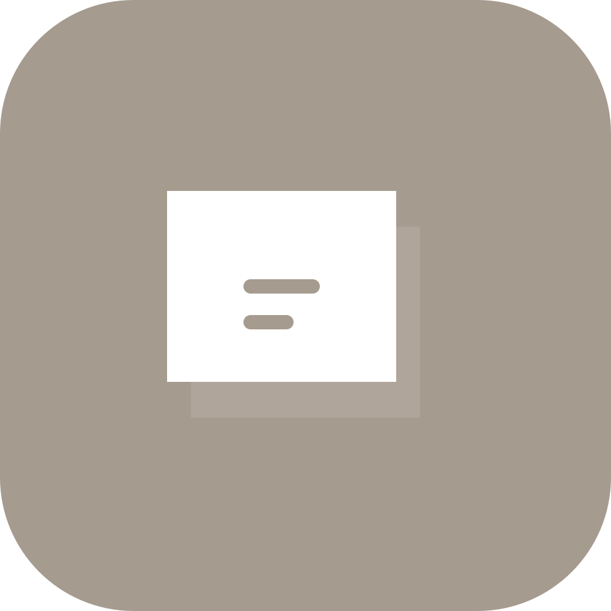
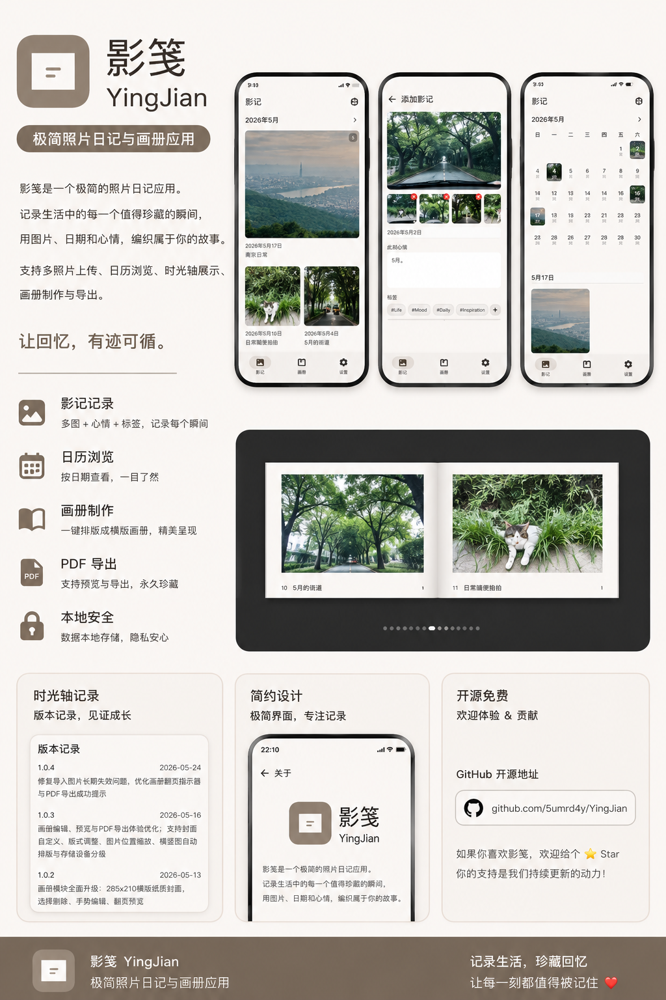
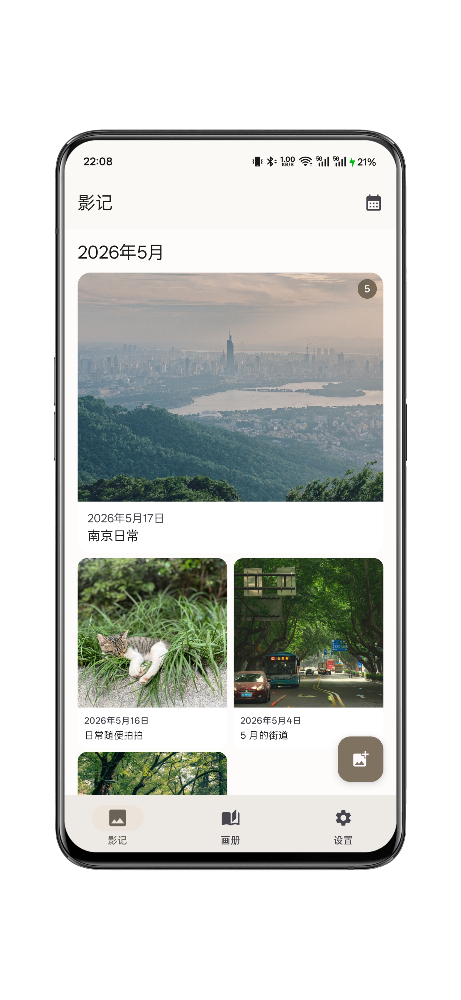
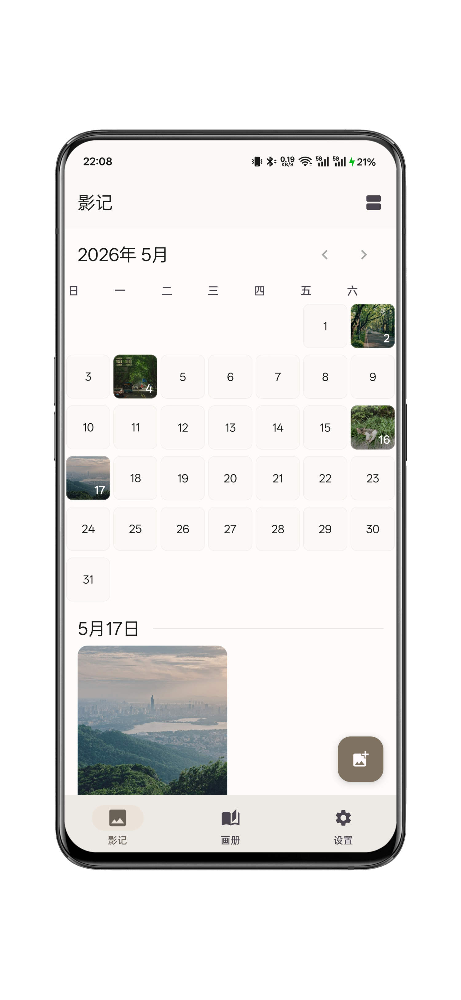
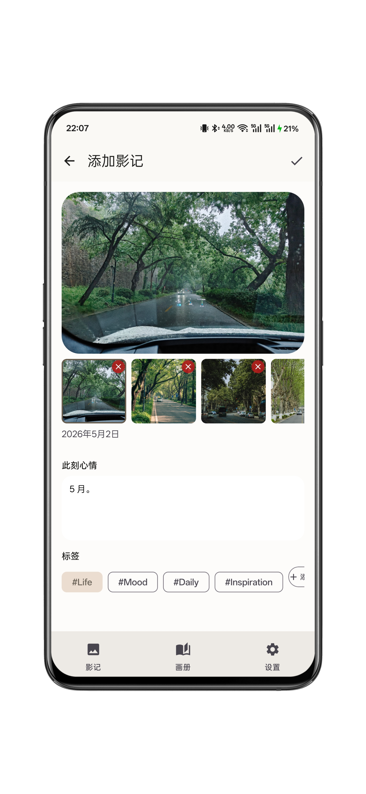
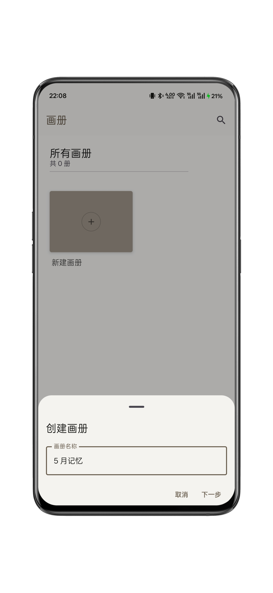
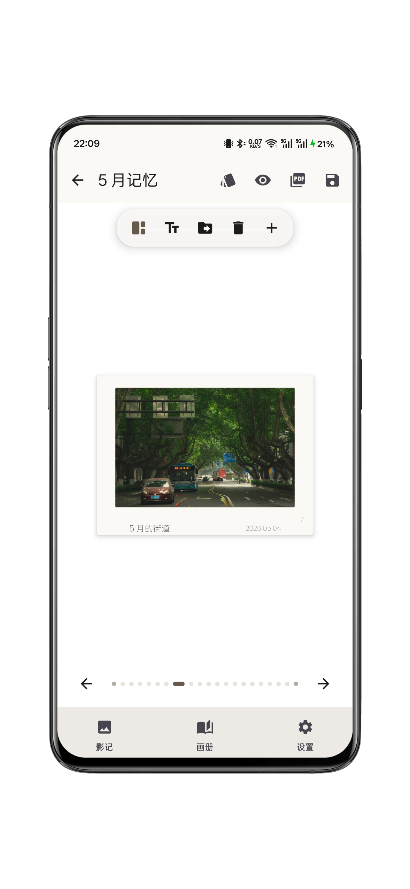
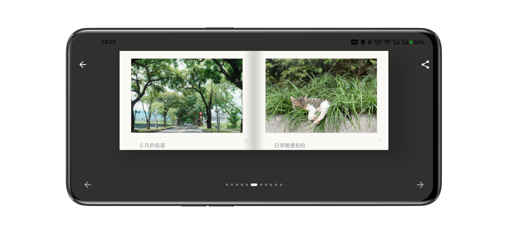
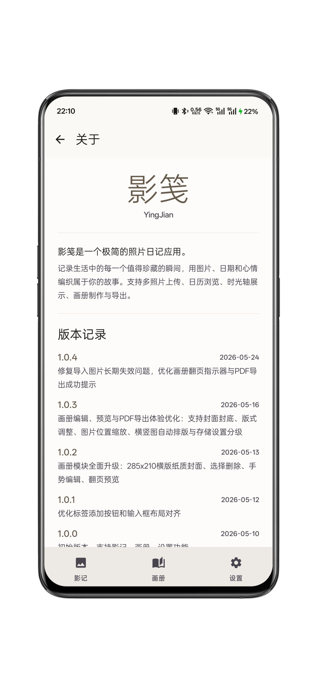

# YingJian

<p align="center">
  
</p>

YingJian（影笺）是一个极简的 Android 照片日记与画册应用。它支持记录影记、按时间浏览照片，并将照片与心情文字排版成横版画册，支持预览和 PDF 导出。

## Features

- 照片影记：记录照片、日期、心情文字和标签。
- 日历与时间线：按日期浏览已记录内容。
- 画册编辑：支持封面、封底、单图横版、单图竖版、双图和四宫格版式。
- 图片调整：支持图片位置移动和缩放，保存后用于预览和导出。
- 画册预览：横屏双页展开，竖屏单页预览。
- PDF 导出：按画册页面顺序导出封面、内页和封底。
- 存储设置：预留本地、S3、SMB、FTP 存储配置入口。

## Screenshots

<p>
  
  
  
  
  
  
  
  
</p>

## Tech Stack

- Kotlin
- Jetpack Compose
- Material 3
- Room
- Coil
- Gradle Kotlin DSL

## Requirements

- Android Studio with JDK 17
- Android SDK 35
- Gradle wrapper included in this repository

## Build

```bash
export JAVA_HOME="/Applications/Android Studio.app/Contents/jbr/Contents/Home"
./gradlew :app:assembleDebug
```

Debug APK output:

```text
app/build/outputs/apk/debug/app-debug.apk
```

## Tests

```bash
export JAVA_HOME="/Applications/Android Studio.app/Contents/jbr/Contents/Home"
./gradlew :app:testDebugUnitTest
```

## Project Structure

```text
app/src/main/java/com/yingjian/
  core/          Shared data, navigation, theme, and utilities
  feature/
    memories/   Photo memory screens and timeline/calendar UI
    photobook/  Photobook editor, preview, layout, and PDF export
    settings/   Settings and storage configuration UI
```

## Privacy

YingJian stores app data locally by default. Remote storage integrations are currently configuration UI placeholders and should be reviewed before production use.

## License

Apache License 2.0. See [LICENSE](LICENSE).
